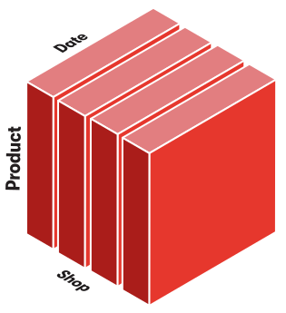
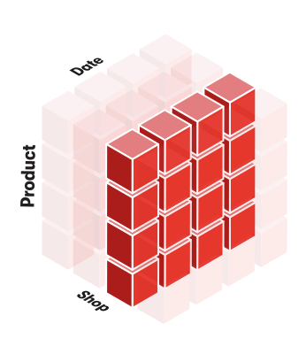

# Instalation

```
pip install atoti[jupyterlab]
```

# Tutorial
Este tutorial irá guiá-lo pelas principais funcionalidades do atoti, criando uma aplicação para analisar as vendas de uma empresa.

Veremos como:

- Carregar dados normalizados em várias tabelas para criar um cubo multidimensional.
- Definir medidas agregadas para fornecer insights específicos da aplicação e de alto nível.
- Construir gráficos e tabelas interativos sem código no JupyterLab.
- Criar painéis na aplicação web integrada.


Para obter mais informações sobre uma funcionalidade, você pode usar a referência da API ou pressionar <kbd>Shift ⇧</kbd> + <kbd>Tab ⇥</kbd> em um símbolo Python no JupyterLab.
## Começando

### Do CSV ao Cubo

Nesta parte do tutorial, você criará seu primeiro cubo a partir de um arquivo CSV e aprenderá conceitos multidimensionais como _cube_, _dimension_, _hierarchy_, _measure_.

Vamos começar criando uma _session_:
```
import atoti as tt

session = tt.Session()
```

Agora podemos carregar os dados de um arquivo CSV em uma tabela em memória chamada de _table_:

```
sales_table = session.read_csv("tutorial/data/sales.csv", keys=["Sale ID"])
```

Podemos dar uma olhada nos dados carregados.
Eles são vendas de uma empresa:
```
sales_table.head()
```

Voltaremos às tabelas com mais detalhes mais tarde, por enquanto usaremos a que temos para criar um _cube_:
```
cube = session.create_cube(sales_table)
```

Isso mesmo, você criou seu primeiro cubo!
Mas o que é um cubo exatamente e como usá-lo?

### Conceitos Multidimensionais

Um _cube_ é uma visualização multidimensional de alguns dados, tornando fácil explorar, agregar, filtrar e comparar.
Ele é chamado de cubo porque cada atributo dos dados pode ser representado como uma dimensão do cubo:


Os eixos do cubo são chamados de _hierarchies_.
O objetivo da análise multidimensional é visualizar alguns indicadores numéricos em coordenadas específicas do cubo.
Esses indicadores são chamados de _measures_.
Um exemplo de medida seria a quantidade de produtos vendidos.

Podemos listar as hierarquias em nosso cubo:
# Dando um nome de variável mais curto para a propriedade hierarchies porque a usaremos muito.
```
h = cube.hierarchies
h
```

O cubo criou automaticamente uma hierarquia para cada coluna não numérica: **Date**, **Product**, **Sale ID** e **Shop**.

Você pode ver que as hierarquias são agrupadas em dimensões.
Aqui temos uma única dimensão chamada de **Sales**, que é o nome da tabela da qual as colunas vêm. Veremos como mover hierarquias entre dimensões mais tarde.

As hierarquias também são compostas de _levels_.
Níveis da mesma hierarquia são atributos com uma relação pai-filho.
Por exemplo, uma cidade pertence a um país, então **Country** e **City** poderiam ser os dois níveis de uma **Geography** hierarquia.

No momento, para simplificar, temos apenas hierarquias de um único nível.
```
l = cube.levels
```

Vamos dar uma olhada nas medidas do cubo que foram inferidas dos dados:

```
m = cube.measures
m
```

O cubo criou automaticamente as medidas _sum_ e _mean_ de agregações para todas as colunas numéricas do conjunto de dados.

Observe que uma medida não é um único número de resultado, é mais uma fórmula que pode ser avaliada para quaisquer coordenadas do cubo.

Por exemplo, podemos consultar a _grand total_ de **Quantity.SUM**, que significa somar as quantidades vendidas em todo o conjunto de dados:


```
cube.query(m["Quantity.SUM"])
```

Mas também podemos _dice_ consultar o cubo para obter a quantidade para cada **Shop**, o que significa tomar um _slice_ da cubo para cada **Shop**:



```
cube.query(m["Quantity.SUM"], levels=[l["Shop"]])
```

Podemos _slice_ em um único **Shop**:


```
cube.query(
    m["Quantity.SUM"],
    filter=l["Shop"] == "shop_0",
)
```

Nós podemos fatiar ao longo de 2 eixos diferentes e obter a quantidade por produto e data.


```
cube.query(m["Quantity.SUM"], levels=[l["Date"], l["Product"]])
```

Podemos até mesmo combinar essas operações para fatiar em uma hierarquia e cortar em outras duas.



```
cube.query(
    m["Quantity.SUM"],
    levels=[l["Date"], l["Product"]],
    filter=l["Shop"] == "shop_0",
)
```

### Primeira visualização

Até agora, usamos [cube.query()](../../lib/atoti/atoti.cube.rst#atoti.Cube.query) que retorna uma tabela como um pandas DataFrame, mas uma maneira melhor de visualizar dados multidimensionais é uma tabela dinâmica.
Com a extensão JupyterLab da atoti, você pode fazer visualizações avançadas e interativas, como tabelas dinâmicas e gráficos diretamente no seu notebook chamando [session.visualize()](../../lib/atoti/atoti.session.rst#atoti.Session.visualize).

Isso criará um widget e abrirá a aba do atoti à esquerda com ferramentas para manipular o widget.

Vamos começar criando uma tabela dinâmica:

- Execute `session.visualize()`.
- No painel esquerdo, clique em uma medida como **Quantity.SUM** para adicionar isso.
- Click em uma hierarquia como **Date** para obter a quantidade por data.
- Arraste e solte outra hierarquia, como por exemplo: **Product** para **Columns** seção para obter a quantidade vendida por dia e por produto.


```
session.visualize()
```

Uma tabela dinâmica pode ser convertida em um gráfico.

Por exemplo, vamos mudar para um gráfico de linha simples.


```
session.visualize()
session.link()
```

### Drilldown e filtros.

A análise multidimensional é feita de cima para baixo: comece visualizando os indicadores no nível mais alto e depois aprofunde para explicar as principais cifras com mais detalhes.

Por exemplo, podemos visualizar algumas medidas por data e depois aprofundar em **Shop** para uma data específica, e então ver os produtos vendidos por uma loja específica nesta data.

Usando a representação anterior do cubo, é como se estivéssemos dando um zoom cada vez maior em uma parte do cubo.


```
session.visualize()
```

As hierarquias podem ser filtradas ao construir widgets.
Vamos aplicar um filtro no gráfico anterior e visualizar apenas a quantidade de um grupo de produtos selecionados.


```
session.visualize()
```

### Aplicativo de painel

Ser capaz de construir rapidamente widgets dentro de um notebook sem codificação é bom para explorar rapidamente os dados, iterar em seu modelo e compartilhar alguns resultados.
No entanto, para fornecer insights mais ricos, os painéis são ainda melhores.
É por isso que o atoti vem com um aplicativo web que pode ser acessado fora do notebook e onde os widgets podem ser dispostos para formar painéis.

O aplicativo pode ser acessado neste link:

```
session.link()
```

É possível publicar widgets construídos no notebook para o aplicativo clicando com o botão direito sobre eles e selecionando "Publish widget in app".
Em seguida, estarão disponíveis na seção "Saved widgets".


## Enriquecendo o cubo

Na seção anterior, você aprendeu como criar um cubo básico e manipulá-lo.
Agora iremos enriquecer este cubo com atributos adicionais e medidas mais interessantes.
### Join

Atualmente, temos informações muito limitadas sobre nossos produtos: apenas o ID.
Podemos carregar um CSV contendo mais detalhes em uma nova tabela:

```
products_table = session.read_csv("tutorial/data/products.csv", keys=["Product"])
```

Observe que uma tabela pode ter um conjunto de chaves.
Essas chaves são as colunas que tornam cada linha única.
Aqui, é o ID do produto.

Se você tentar inserir uma nova linha com as mesmas chaves de uma linha existente, ela substituirá a existente.

```
products_table.head()
```

Esta tabela contém a categoria, subcategoria, tamanho, cor, preço de compra e marca do produto.
Ambas as tabelas têm uma coluna **Product** que podemos usar para [join](../../lib/atoti/atoti.table.rst#atoti.Table.join) them.

```
sales_table.join(products_table, sales_table["Product"] == products_table["Product"])
```

Observe que esta é uma junção semelhante a um banco de dados e não uma junção semelhante a pandas.
Todos os detalhes de `products_table` não será embutido em `sales_table`.
Em vez disso, apenas declara uma referência entre essas duas tabelas que o cubo pode usar para fornecer mais eixos analíticos.

Você pode visualizar a estrutura das tabelas da sessão:

```
session.tables.schema
```

As novas colunas foram adicionadas automaticamente ao cubo como hierarquias, em uma dimensão com o mesmo nome da nova tabela:
```
h
```

Você pode usá-los diretamente em um novo widget.
Por exemplo, vamos criar um gráfico de barras para visualizar o preço médio por subcategoria de produto:


```
session.visualize()
```

Também podemos fazer um gráfico de rosca para ver como todas as vendas são distribuídas entre as marcas:


```
session.visualize()
```

Observe que após a junção podemos adicionar uma nova medida chamada **Purchase price.VALUE** com base na coluna correspondente da tabela unida.
Esta medida representa o valor da coluna, por isso só é definida quando todas as chaves da tabela unida são expressas na consulta.

```
m["Purchase price.VALUE"] = tt.agg.single_value(products_table["Purchase price"])
```

Por exemplo, podemos verificar o preço de compra por **Product**:

```
cube.query(m["Purchase price.VALUE"], levels=[l["Product"]])
```

De forma semelhante, podemos enriquecer os dados sobre as lojas:

```
shops_table = session.read_csv("tutorial/data/shops.csv", keys=["Shop ID"])
shops_table.head()
sales_table.join(shops_table, sales_table["Shop"] == shops_table["Shop ID"])
session.tables.schema
```

### Novas medidas

Até agora, usamos apenas as medidas padrão que são agregações básicas das colunas numéricas.
Podemos adicionar novas medidas personalizadas ao nosso cubo.
#### Preço Máximo

Começaremos com uma agregação simples tomando o preço máximo da tabela de vendas:

```
m["Max price"] = tt.agg.max(sales_table["Unit price"])
```

Esta nova medida está disponível diretamente:

```
cube.query(m["Max price"], include_totals=True, levels=[l["Category"]])
```

#### Operações em nível de fato

Para calcular agregações com base em dados que vêm diretamente das colunas de uma tabela, você pode passar o cálculo diretamente para a função de agregação desejada. Isso é mais eficiente do que primeiro converter as colunas em medidas antes da agregação.

Vamos usar isso para calcular o valor total obtido com a venda dos produtos, bem como a média.

```
m["Amount.SUM"] = tt.agg.sum(sales_table["Quantity"] * sales_table["Unit price"])
m["Amount.MEAN"] = tt.agg.mean(
    sales_table["Quantity"] * sales_table["Unit price"],
)
```

Agora podemos traçar a evolução das vendas por país ao longo do tempo:


```
session.visualize()
```

#### Margem

Agora que o preço de cada produto está disponível na tabela de produtos, podemos calcular a margem.

Nós usamos o [OriginScope](../../lib/atoti/atoti.scope.origin_scope.rst#atoti.OriginScope) realizar a multiplicação da quantidade vendida pelo preço de compra de cada **Product** e depois faça a soma.

```
cost = tt.agg.sum(
    m["Quantity.SUM"] * tt.agg.single_value(products_table["Purchase price"]),
    scope=tt.OriginScope(l["Product"]),
)
m["Margin"] = m["Amount.SUM"] - cost
```

Também podemos definir a taxa de margem que é a relação entre a margem e o valor vendido:

```
m["Margin rate"] = m["Margin"] / m["Amount.SUM"]
cube.query(m["Margin"], m["Margin rate"], levels=[l["Product"]])
```

Vamos usar essa taxa de margem para fazer um _Top 10_ filtre para ver os produtos com a melhor cotação.

Observe que você não precisa colocar a medida de taxa e o nível do produto na tabela dinâmica para aplicar o filtro.


```
session.visualize()
```

#### Soma acumulada ao longo do tempo
Uma soma cumulativa é a soma parcial dos dados até o valor atual.
Por exemplo, uma soma cumulativa ao longo do tempo pode ser usada para mostrar como algumas medidas mudam ao longo do tempo.

```
m["Cumulative amount"] = tt.agg.sum(
    m["Amount.SUM"], scope=tt.CumulativeScope(level=l["Date"])
)
```


```
session.visualize()
```

#### Média por loja
As agregações também podem ser combinadas.
Por exemplo, podemos somar dentro de um **Shop**: depois tire a média disso para ver quanto uma mesa vende em média:

```
m["Average amount per shop"] = tt.agg.mean(
    m["Amount.SUM"], scope=tt.OriginScope(l["Shop"])
)
cube.query(
    m["Average amount per shop"], include_totals=True, levels=[l["Sub category"]]
)
```

### Hierarquias multiníveis
Até agora, todas as nossas hierarquias tinham apenas um nível, mas é melhor reagrupar os atributos com um relacionamento pai-filho na mesma hierarquia.

Por exemplo, podemos agrupar os **Category**, **SubCategory** e **Product ID** níveis em uma hierarquia **Product**:

```
h["Product"] = [l["Category"], l["Sub category"], l["Product"]]
E vamos remover as antigas hierarquias:
del h["Category"]
del h["Sub category"]
h
```

Também podemos fazer com **City**, **State or Region** e **Country** para fazer uma hierarquia **Geography**.

Observe que, em vez de usar os níveis existentes, você também pode definir uma hierarquia com as colunas da tabela em que os níveis serão baseados:

```
h["Geography"] = [
    shops_table["Country"],
    shops_table["State or region"],
    shops_table["City"],
]
del h["Country"]
del h["State or region"]
del h["City"]
```

Como estamos reestruturando as hierarquias, vamos aproveitar para mudar também as dimensões.

Uma dimensão reagrupa hierarquias do mesmo conceito.

Para simplificar aqui, simplesmente moveremos a nova hierarquia **Geography** à sua própria dimensão:

```
h["Geography"].dimension = "Location"
h
```

Com isso, podemos definir novas medidas aproveitando a estrutura multinível.
Por exemplo, podemos criar uma medida indicando o quanto um produto contribui para sua subcategoria:

```
m["Parent category amount"] = tt.parent_value(
    m["Amount.SUM"], degrees={h[("Products", "Product")]: 1}
)
m["Percent of parent amount"] = m["Amount.SUM"] / m["Parent category amount"]
```


```
session.visualize()
```

## polindo o cubo
### Excluir ou ocultar medidas

Algumas medidas foram criadas automaticamente a partir de colunas numéricas, mas não são úteis.
Por exemplo, **Unit Price.SUM** realmente não faz sentido, pois nunca queremos somar os preços unitários.
Podemos excluí-lo:

```
del m["Unit price.SUM"]
```

Outras medidas foram usadas durante a construção do projeto apenas como etapas intermediárias, mas não são úteis para os usuários finais no aplicativo.
Podemos ocultá-los da interface do usuário (eles permanecerão acessíveis em Python):

```
m["Parent category amount"].visible = False
```

### Medir pastas

As medidas podem ser reorganizadas em pastas.

```
for measure in [
    m["Amount.MEAN"],
    m["Amount.SUM"],
    m["Average amount per shop"],
    m["Cumulative amount"],
    m["Percent of parent amount"],
]:
    measure.folder = "Amount"
m
```

### Formatadores de medida

Algumas medidas podem ser formatadas para uma exibição mais agradável.
Exemplos clássicos disso são alterar o número de decimais ou adicionar uma porcentagem ou um símbolo de moeda.

Vamos fazer isso para nossa porcentagem do valor pai e taxa de margem:

#### Antes

```
cube.query(m["Percent of parent amount"], m["Margin rate"], levels=[l["Category"]])
m["Percent of parent amount"].formatter = "DOUBLE[0.00%]"
m["Margin rate"].formatter = "DOUBLE[0.00%]"
```

#### Depois

```
cube.query(m["Percent of parent amount"], m["Margin rate"], levels=[l["Category"]])
```

## Simulações

Simulações são uma forma de comparar vários cenários e fazer análises hipotéticas.
Isso ajuda a entender como a alteração dos dados de origem ou de uma parte do modelo afeta os principais indicadores.

No atoti, o modelo de dados é feito de medidas encadeadas.
Uma simulação pode ser vista como alterando uma parte do modelo, seja seus dados de origem ou uma de suas definições de medida e, em seguida, avaliando como isso afeta as medidas a seguir.

### simulação de source

Vamos começar mudando a source.
Com pandas ou Spark, se você quiser comparar dois resultados para versões diferentes do conjunto de dados de entrada, terá que reaplicar todas as transformações ao seu conjunto de dados.
Com o atoti, basta fornecer os novos dados e todas as medidas estarão automaticamente disponíveis para ambas as versões dos dados.

Criaremos um novo cenário usando pandas para modificar o conjunto de dados original.
import pandas as pd
Por exemplo, podemos simular o que aconteceria se tivéssemos conseguido comprar alguns produtos a um preço mais barato.

```
products_df = pd.read_csv("tutorial/data/products.csv")
products_df.head()
better_prices = {
    "TAB_0": 180.0,
    "TAB_1": 250.0,
    "CHA_2": 40.0,
    "BED_3": 110.0,
    "BED_4": 210.0,
}
for product, purchase_price in better_prices.items():
    products_df.loc[
        products_df["Product"] == product, "Purchase price"
    ] = purchase_price
products_df.head()
```

Agora podemos carregar esse novo dataframe em um novo cenário da tabela de produtos.
products_table.scenarios["Cheaper purchase prices"].load_pandas(products_df)
A sessão agora tem dois cenários e as únicas diferenças entre eles são as linhas correspondentes aos produtos com melhores preços, todo o resto é compartilhado entre os cenários e não foi duplicado: os cenários de origem em atoti são eficientes em memória.


Usando o a hierarquia **Source Simulation**, podemos exibir a margem do cenário e compará-la com o caso base.


```
session.visualize()
```

Observe que todas as medidas existentes estão imediatamente disponíveis nos novos dados.
Por exemplo, a taxa de margem ainda existe, e podemos ver que nesse cenário teríamos uma margem melhor para os produtos Móveis.


```
session.visualize()
```

### Simulações de parâmetros

A outra técnica de simulação é criar uma medida de parâmetro cujo valor pode ser alterado para algumas coordenadas.

Ao criar a simulação, você pode escolher em qual granularidade a modificação se aplica.
Por exemplo, podemos criar uma medida de parâmetro cujo valor mudará dependendo do país.
Fazendo isso, podemos responder a perguntas como "O que acontece se houver uma crise na França e vendermos 20% menos?"

```
country_simulation = cube.create_parameter_simulation(
    "Country Simulation",
    levels=[l["Country"]],
    measures={"Country parameter": 1.0},
)
```

Isso criou uma medida chamada **Country parameter** e adicioná-lo ao cubo. Por enquanto, seu valor é `1` em todos os lugares, mas usando o `country_simulation` podemos mudar isso.

Ao adicionar valores na tabela, você pode alterar o valor da medida do parâmetro dependendo dos níveis usados na simulação e no cenário.

```
country_simulation += ("France Crisis", "France", 0.80)
country_simulation.head()
```

Vamos substituir o existente **Quantity.SUM** e **Amount.SUM** medidas com novas usando a medida de parâmetro da simulação.

```
m["Quantity.SUM"] = tt.agg.sum(
    tt.agg.sum(sales_table["Quantity"]) * m["Country parameter"],
    scope=tt.OriginScope(l["Country"]),
)
m["Amount.SUM"] = tt.agg.sum(
    tt.agg.sum(sales_table["Unit price"] * sales_table["Quantity"])
    * m["Country parameter"],
    scope=tt.OriginScope(l["Country"]),
)
```

Podemos consultar o cubo usando o novo nível **Country Simulation**  para comparar a quantidade e valor entre o caso base e nosso novo cenário:

```
cube.query(
    m["Quantity.SUM"],
    m["Amount.SUM"],
    include_totals=True,
    levels=[l["Country Simulation"], l["Country"]],
)
```

Aqui, por exemplo, como o valor foi modificado, as medidas que dependem dele, como o valor acumulado, também são impactadas:

```
cube.query(m["Cumulative amount"], levels=[l["Country Simulation"], l["Country"]])
```

Vamos tentar adicionar um cenário diferente:

```
country_simulation += ("US boost", "USA", 1.15)
cube.query(m["Quantity.SUM"], levels=[l["Country Simulation"], l["Country"]])
```

Os dois cenários podem ser visualizados no mesmo widget:


```
session.visualize()
```

Finalmente, podemos até combinar as diferentes simulações (a de origem e a de medida) para criar uma matriz de cenários:


```
session.visualize()
```

## Indo além

Você aprendeu todos os fundamentos para construir um projeto com atoti, desde o conceito de análise multidimensional até simulações poderosas.

Agora, encorajamos você a experimentar a biblioteca com seus próprios dados.
Você também pode começar a aprender recursos mais avançados, como [session configuration](../../lib/atoti/atoti.session.rst), [custom endpoints](../../lib/atoti/atoti.session.rst#atoti.Session.endpoint), [querying](../../lib/atoti-query/atoti_query.rst), e [arrays](../../lib/atoti/atoti.array.rst).